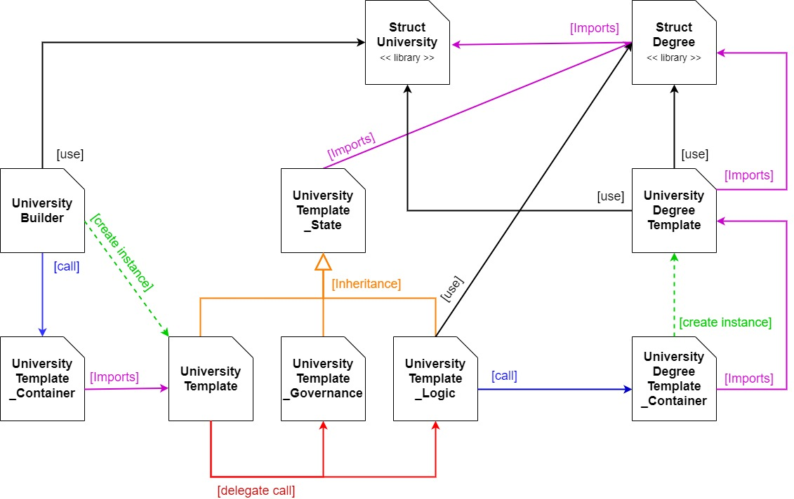

# blockchain-developer-bootcamp-final-project
##### Author: David Gimenez Gutierrez

This is my final project repository for ConsenSys Academy 2021 Blockchain Developer Bootcamp to obtain the certification of Blockchain Developer.

### My Ethereum Mainet Account Address

**0x**

### Objective

The objective of this project is to create a protocol based on Blockchain technology, which allows graduates of educational institutions to digitally validate the degrees obtained with the support of the issuing educational institution and to allow educational institutions to issue certified degrees backed by Blockchain technology.

The degree could be consulted electronically in the blockchain by third parties, with total confidence from anywhere in the world and with the same validity as the degree in paper.

The project will consist in the creation of a set of Smart Contracts and a web application that allows the validation of academic degrees in a safe, transparent and efficient way.

Using a distributed database system based on Blockchain technology, asymmetric cryptography and hash functions, thus allowing unequivocally identifying the intervening parties, as well as storing information safely to be consulted by third parties.

### Main project information

**Public FrontEnd Web Site:**    
http://

**Public Ethereum Address in Rinkeby:**
    **universityBuilder_contractAddress:**              0x553Caa0447374b29A53928666C6ec426c3eC9F4e
    **universityTemplateContainer_contractAddress:**    0xa101CDB4B8D12AFd0556DfF4E109F8AC01e97a22
    **universityTemplateGovernance_Contract:**          0x2da7Dc8B7cdC6f1066B16c8053F667B31CA489bc
    **UniversityTemplate_Logic_Contract:**              0x570b440e86Eb0458e598fed7eb560848Be3B2371
    **universityTemplateDegreeContainer_contract:**     0xfccC0F102C978BC463A0ce8AB1fDbb05b8f42803

### Tutorials videos

**Installation process video**      https://youtube
**Run tests video**                 https://youtube
**Coplate demo of the protocol**    https://youtube

### Repository installation process

1. Install Visual Sutidio Code: https://code.visualstudio.com/

2. Install NodeJS that includes npm: https://nodejs.org/en/download/

3. Install Git that includes bash terminal: https://git-scm.com/download/win

4. **Recommended:** Set Git bush as you default terminal in VSCode
    * Open the command palette using Ctrl + Shift + P.
    * Type - Select Default Profile
    * Select Git Bash from the options

5. Install the following extensions in VSCode
    * Solidity - Juan Blanco
    * Live Server - Ritwick Dey

6. Install MetaMask as an Chrome extension: https://metamask.io/

7. Install truffle with the following command
    * npm install -g truffle

8. Clone the repo with the following git command:
    * git clone https://github.com/David-Gimenez/blockchain-developer-bootcamp-final-project.git

9. Open project folder in VSCode

10. Set up project with the following commands
    * npm install

11. Fill in the .env file with your wallet account address for the environment you are going to use
    The .env file was included into the repository only with an empty variable structure and the seed phrase used in the Ganache client locally for testing purpose.
    **IMPORTANT: Private keys and mnemonic provided in this .env file are NOT safe. You should NOT rely on them to secure blockchain assets or use it in a production environment**

    Environments
    * Ethereum Rinkeby network
    * Ganache network

    For example for Ganache the variables are:
    * GANACHE_MANAGER_ADDRESS:  The address used in the deploy and manager role in the protocole
    * GANACHE_MANAGER_PK:       The private key used in the deploy and manager role in the protocole
    * GANACHE_RECTOR_PK:        The private key used as the Rector role in the protocole
    * GANACHE_DEAN_PK:          The private key used as the Dean role in the protocole
    * GANACHE_DIRECTOR_PK:      The private key used as the Director role in the protocole
    * GANACHE_GRADUATE_PK:      The private key used as the Graduated role in the protocole

### To run the tests

1. Execute the following commands in this order
    1. truffle compile
    2. truffle develop
    3. test

### To test the project with live server and truffle develop

- You can see the full demo at: 

1. Add the truffle develop virtual blockchain network to MetaMask. To do this, follow the following steps:
    1. Go to MetaMask and click on network list
    2. Select add network
    3. Add the information to set up Truffle Develop virtual network
        * Network Name:       Truffle Develop (The name is not relevant)
        * RPC URL:            http://127.0.0.1:9545/
        * Chain ID:           1337
        * Symbol:             ETH
        * Block explorer URL: Empty
    4. Confirm the operation
    
2. Execute the following command in the VSCode terminal: 
    **truffle develop**
    This will display a list of 10 accounts and 10 private keys that will be used later

3. Inside the truffel develop console run the following command: 
    **migrate**
    This will deploy the contracts on the virtual blockchain of truffle develop

4. Add private keys to MetaMask to represent each user (Manager, Rector, Dean, Director and Graduate):
    1. Go to MetaMask and click on the account button. It's the colored, circular button in the upper-right corner of the wallet.
    2. Click on 'Import Account'
    3. Copy the first Private Key of the list show by truffle develop and past it in the private key box
    4. Click on 'Import' button
    5. Rename the imported account with a name related to the names of the actors (Manager, Rector, Dean, Director or Graduate)
        To do this, follow the following steps
        * Click on the three dots to the right of the account name
        * Select account details
        * On the right side of the account name, click on the pencil drawing to edit the name
        * Rename the account as for example: 'Manager - Truffle Develop'
        * Confirm the operation
    6. Repeat this operation 4 more times to import other 4 accounts for Rector, Dean, Director and Graduate to be able to complete the test

5. On the 'index.html' file right click and select 'Open with Live Server'. This will open a browser with the landing page for the project
    
6. This page will show 3 options: System, University and Graduate. That options represents 3 differents paths for the 3 differents actores of the protocole.
        **System:** This path is for the administrators of the protocols. Allow to create universities conctracts that represents a University institution.
        **University:** THis path is for a specific university. Allow to load the authorities of the university and issue degree titles by creating contracts
        **Graduate:** THis path is for graduated students that receive the University Degree title. Allow to query the degree title information
    
    * In all paths at the top rigth side of the screen you have the button to connect to MetaMask. 
        - If MetaMask is not installed the button will show '**No wallet detected**'.
        - If MetaMask is installed the button will show '**Connect MetaMask**'.
    
    * In all paths at the top left side of the screen you have the button to go back to home page, the lading page. 

    * In all paths at the left side of the screen you will see the menu with the operation allowed for this path.
    
7. Lets beggin with the administration path to set up the protocole.
    1. Click on System path
    2. The first option in the menu is '**Status**', this option will query the blockchain and show the information from the UniversityBuilder contract once you connect with MetaMask.
    3. To see the information connect MetaMask, click on '**Connect MetaMask**' button. This will query the bockchain and show the information.

### overview of the project

#### Project Folder Structure

##### app

This folder hold the FrontEnd aplication code.
Include:
* HTML pages
    * **index.html**        This is the sample landing page for the degree certification protocol. Show the three possible paths, one for each role in the protocol
    * **system.html**       This is the sample page that emulate the backoffice site for each degree certification protocol administrator. From here new university contracts instance can be created and set up. Communicates with the 'UniversityBuilder' contract
    * **university.html**   This is the sample page that emulate the backoffice site for each university that use the degree certification protocol. Communicates with the University contracts and allow to set up university authorities and issue new Degree contracts.
    * **graduate.html**     This is the sample page that emulate the site for each graduate that receive an University Degree Title throw the protocol. It communicates with the University Degrees contracts. Allows to consult the University Degree information of the account connected through MetaMask that represents a graduate.
* Folders
    * **css**
    * **img**
    * **js**

##### contracts

This folder containsthe the contracts of the protocole divided in sub folders.
In this document you will also find the description of the architecture of the project where the responsibility of each contract is explained

* **libraries folder:**     Include the two libraries created for the project that define structures and enums
* **university folder:**    Inlcude the "UniversityBuilder.sol" file.
* **template folder:**      Include the templated contracts for University and Degree and all contracts related to the business process carried out for the University role
* **forTest:**              Include only one contract that is only used in test cases and is only deployed in the migration process over testnets ('Develop', 'Ganache') 

##### deployInformation

This folder contains the 'deployInformation.json' file in which after each migration process, the address of the deployed contracts are automatically stored separated by environment along with the deployed date and deployer address. That way, give a easy way to access the address of the deployed contracts.
The structure of the file it is as follow, for example for the 'development' environment, which is the truffle develop virtual blockchain environment:

* deployDate
* deployer_accountAddress
* universityBuilder_contractAddress
* universityTemplateContainer_contractAddress
* universityTemplateGovernance_Contract
* UniversityTemplate_Logic_Contract
* universityTemplateDegreeContainer_contract

##### migrations

This folder contains the migrations scripts for the project.

##### test

This folder contains the test scripts for the functionalities in the Smart Contracts.
In total there are 22 different tests, but each test can include more than one validation on the same use case.

### Overview of the protocol

This protocol foresees the participation of three actors:

* Protocol administrators
* University administrators
* Graduates who received academic degrees

In this sense, the landing page of this project has three sections, one for each actor of the protocol.
In production these sites should be three different platforms, but for the sample in this project they have been unified as a single platform.

### Roles and Responsibilities

* Protocol administrators

Use the functionalities of the 'UniversityBuilder' contract to create through this new contracts for each University that wishes to use the protocol, using the 'UniversityTemplate' contract as a template

* University administrators

Use the functionalities of the university contract created by the 'UniversityBuilder' contract to represent your University and from there, manage the issuance of new academic degrees by creating a new smart contract for each new degree using the 'UniversityDegreeTemplate' contract as a template.

* Graduates who received academic degrees

Query the information of your University Degree, through the smart contract that represents it, and that was created by the smart contract that represents your University.

### Smart Contracts Architecture

#### Smart Contracts responsibilities

**StructUniversity**

This library contains the structures that represent the objects that universities need to store their information within the protocol.

**StructDegree**

This library contains the structures that represent the Degree objects that universities need to store their degree information within the protocol.

**UniversityBuilder**

This smart contract contains the main logic for protocol administrators to subscribe new universities to the protocol by creating new smart contracts representing the new universities.
This contract calls the contract **UniversityTemplate_Container** requesting the bytecode of the contract **UniversityTemplate** to create a new smart contract with an assembly command based on that code.

**UniversityTemplate_Container**

This smart contract contains the logic for extract the bytecode from the **UniversityTemplate** contract and return it.
operations over this smart contract are only allowed to the **UniversityBuilder** contract stored internally.

The reason for not obtaining the **UniversityTemplate** contract bytecode directly from the **UniversityBuilder** contract, is that the protocol was intended to be upgradeable, so the template codes to create new universities or new university degrees are contained in contracts that are deployed in the blockchain, and through another contract the bytecode of these contracts can be obtained but for this operation to work, the contract that obtains the code must know the interface of the contract that owns the code, in other words, it must import it and for reasons of contract size the **UniversityTemplate** contract could not be included in the **UniversityBuilder** contract because it exceeded its size limit.

**UniversityTemplate**

This smart contract it is the template contract for the creation of new contract that represents each university enrolled in the protocole.
For each new university that use the protocol, the **University Builder** contract will create a new smart contract base in this contract template.

In this way, each university will have its own contract to issue new University degrees.

The operations and functionalities of a University are many and could undergo changes over time, so the protocol was designed to allow these functionalities to be updated in the future, without the need to create a new university contract for the same university. In order to allow this, the functionalities and logic of the **UniversityTemplate** contract were divided into three contracts, one to be inherited and two to be used and updated independently. 

So in the future, if the logic need to be updated, a new contract logic will be deployed to the blockchain and the **UniversityTemplate** contract instance of the University related will be updated to call this new deployed contract with the new logic.

These contracts are the following:

* **UniversityTemplate_State**

This smart contract contains the state variables and mappings to store all the information that universities need to work with the protocol.
This smart contract is intended to be inherited by **University Template** contract.

* **UniversityTemplate_Governance**

This smart contract contains the logic to establish the university authorities as Rector, Dean and Director, who are the people who sign the degree titles that will be issued by the university.

* **UniversityTemplate_Logic**

This smart contract contains the main logic for the operation of an university, including:
* Request a new degree titles with the corresponding information
* Calculate the hash corresponding to the information of a requested degree, which will be used to be digitally signed by the university authorities
* Allow university authorities to sign the hash calculated from the information of the new degree to be issued
* Predict in advance the address of the future smart contract that will be created on the blockchain to represent the new degree title to be issued
* Create a new smart contract that represent a new degree title in the predited address on the blockchain
* Query the smart contract created that represents degree title on the blockchain

Only the authorized accounts of the Manager, Rector, Dean and Director can operate over this university contracts.

**UniversityDegreeTemplate**

This smart contract represents a University Degree title issued on the blockchain by an university enrolled in the protocole.

This smart contract will be used as a template for the creation of each new degree. In this way, the protocol allows updating the template that is used to create new degree titles in the blockchain, because in the future, if the information of the degree title needs to be updated, another version of the **UniversityDegreeTemplate ** contract can be deployed  on the blockchain to be used as a new template for new degrees titles to be issued.

Each instance of the contract is created for a specific graduate of the university that issues the degree title, so only the graduate is the owner of the contract and only him can access the information.

A possible future improvement may be to allow query the contract information based on a code issued by the owner of the contract.

**UniversityDegreeTemplate_Container**

This smart contract contains the logic for extract the bytecode from the **UniversityDegreeTemplate** contract and return it.
Operations on this smart contract are only allowed to a specific university contract.

The use of this contract is analogous to the use explained in the **UniversityTemplate_Container** contract.

### Business processes

#### Create new University contract

1. The **UniversityBuilder** contract queries the **UniversityTemplateContainer** contract to get the bytecode from the **UniversityTemplate** contract to create a new contract using that bytecode
2. The **UniversityBuilder** contract creates a new university contract using the bytecode obtained in 1. and the information provided by the protocol administrator of the new university.

#### Manage University contract

1. The account of the manager of the university will load to the contract the address of the auxiliar contracts of the university contract:
    * UniversityTemplate_Container
    * UniversityTemplate_Governance
    * UniversityTemplate_Logic
2. The account of the manager of the university will load to the contract the accounts of the main authorities of the University who will be the ones who will sign the Degree titles that will be issued.
    * Rector
    * Dean
    * Director

#### Issue a new degree title

1. The account of the university manager will load the information of the new degree title to be issued with the name of the graduate, name of the degree to be issued, date, etc.
2. The university manager account will use the functionalities of the university contract to predict the address of the contract of the new degree to be issued with the use of a Salt number to calculate the address.
3. The university administrator account will generate the hash to be signed by the university authorities, based on the address of the new contract to be issued, the data of the graduate and the data of the degree to be issued. All that information is hashed to be signed together.
4. The university authorities (Rector, Dean, Director) must proceed one by one to digitally sign the hash generated in the previous point with their personal private key. This process is carried out locally on the client machine through MetaMask, so that the private keys are never revealed.
5. Internally in the university's smart contract, each time a new signature is received, it is validated that the sender of the signature is one of the university authorities authorized to sign degrees and the signature is validated using the EIP-712 standard for validation of digital signatures on the blockchain. In this process, the sender's address is obtained from the signature and comparing against the sender address.
6. Once the title has received the 3 signatures required by the 3 university authorities, it is ready to be published. In this publication process, the university contract obtains in a low-level call to the UniveristyDegreeTemplate_Container contract the bytecode of the UniversityDegreeTemplate contract to be used to create a new contract that will represent the new degree issued, which will contain:
    * The information of the issuing university
    * The information of the graduate
    * The information of the issued degree
    * All the digital signatures generated by the university authorities
So that everything can be validated

#### Query an issued degree title

There are two ways to do this

1. Universities can consult the data of all the degrees they have issued

2. Graduates who own a degree title can consult their degree information on the graduate screen

Errores posibles
Si al ejecutar una transacción da un error de TX no tiene el nonce correcto
    Se debe resetear el nonce de la accunt en question
    Para eso ir a el icono del usuario --> Configuracion --> Avanzado --> Restablecer cuenta
    Confirmar la operacion

------
Install Ganache: https://trufflesuite.com/ganache/

### About the author

- Author:   **David Gimenez Gutierrez**
- Linkedin: 

    